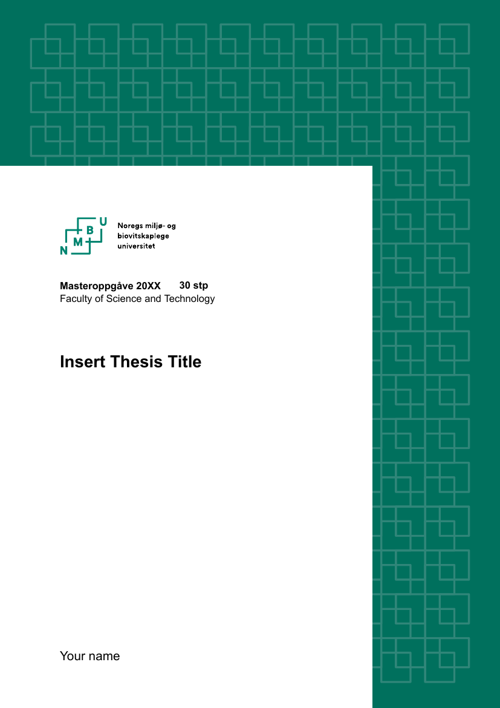
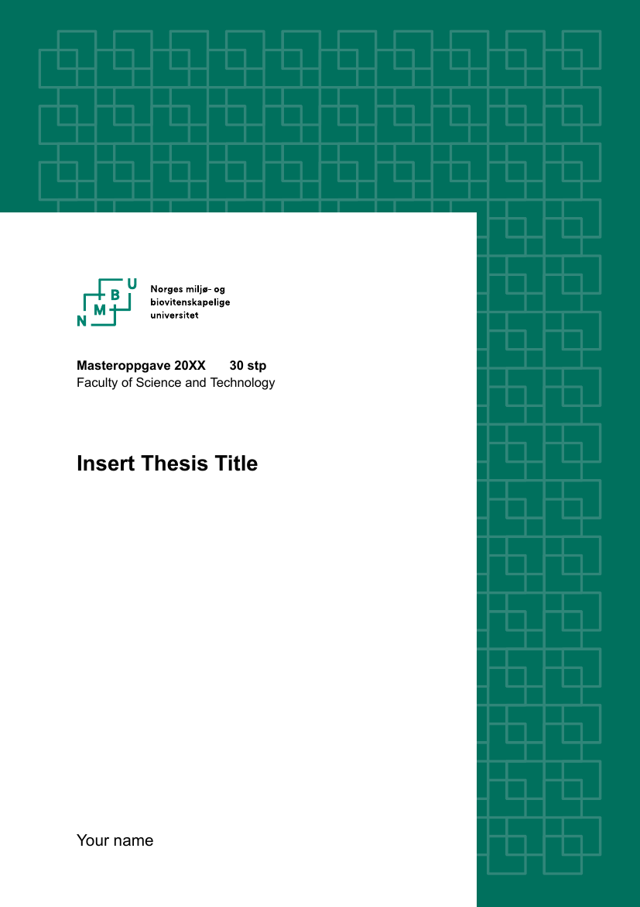

# NMBU LaTeX Thesis Template

<picture>
  
  
  
</picture>

Repository for the LaTeX Master's and PhD's templates following NMBU's templates. The easiest way to obtain these is via [Overleaf's Gallery](https://www.overleaf.com/latex/templates/nmbu-thesis-template/zhnnqhptjkhs).

Version `v0.4.0` introduced the first template for PhD theses. It is not perfect yet, but you can now start using it.

The dotx versions can be found in [Norwegian](https://main-bvxea6i-kdsvgmpf4iwws.eu-5.platformsh.site/sites/default/files/2024-12/Omslag_Master_forside_norsk.dotx) and [English](https://main-bvxea6i-kdsvgmpf4iwws.eu-5.platformsh.site/sites/default/files/2024-12/Omslag_Master_forside_engelsk.dotx) at NMBU's [Skjema og maler for studenter](https://www.nmbu.no/studenter/skjema-og-maler-student#:~:text=Forside%2D%20og%20baksidemaler%20for%20bachelor%2D%20og%20masteroppgaver). [Backpage](https://main-bvxea6i-kdsvgmpf4iwws.eu-5.platformsh.site/sites/default/files/2024-12/Omslag_Master_bakside.dotx) is identical for all languages.

If you have any questions or you wish to add features and improve this LaTeX template, feel free to write to me: leonardo.rydin@gmail.com
